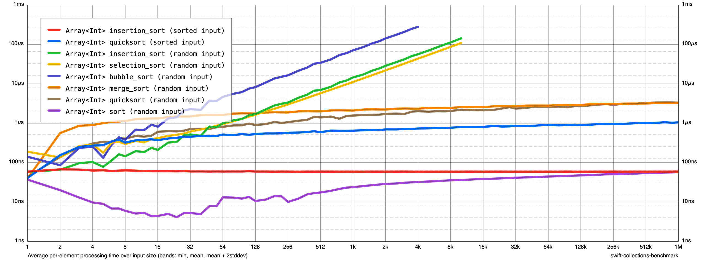

## algorithms

A collections of algorithms. 

> (Sometimes 10x slower than the algorithms in standard library.😿)
> (Trying to make it fast).

## Benchmarks

### Sorting

> Note: All graphs plot the average per-element processing time on a log-log scale. Lower is better. The benchmarks were run on my 2020 iMac with 10-core Intel® Core™ i9.
